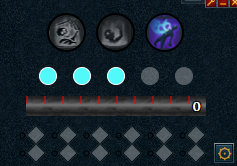
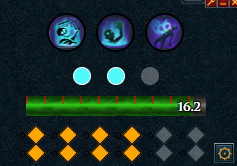
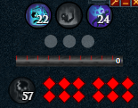

# (Nyu's) Necro Job Gauge

Track your Residual Souls, Necrosis stacks, summoned Conjures, and Bloat all in one consistent place. Inspired by FFXIV's Job Gauges - to make tracking your resources as easy as can be!

  

## How to Install & Required Settings

To install Better Buff Bar copy & paste this link into Alt1's browser app:
`alt1://addapp/https://nadyanayme.github.io/NyusNecroJobGauge/dist/appconfig.json`

If you do not have Alt1 Toolkit installed already you can [download it from runeapps.org](https://runeapps.org/alt1). In order for Necromancy Job Gauge to work make sure your Runescape settings for buff bar size is set to `small` and that your Game and UI Scale settings are set to `100%` as these settings are required for Alt1 to be able to read your game screen.

**Currently only works with Small Buff icons**. Alt1's BuffReader only works with small buff icons so this is unlikely to change soon.

## Features

- Track summoned conjures & remaining timers
- Track Residual Soul stacks
- Track Bloat if applied (reapplying can't be detected - see known issues)
- Track Necrosis Stacks
- Track Living Death (Active & Cooldown timers)
- Opt-in Audio cues for max stacks of Residual Souls or Necrosis Stacks
- Positional Overlay (click-passthrough)
- Scale job gauge or individual components between 30-200% size
- Hide unwanted components

## Settings

Click the cog wheel in the bottom right to access the settings. It is suggested that you make the app window larger - as the settings will render below the job gauge so that you can see changes reflect on the gauge as you change them!

- Switch between 3 or 5 Residual Souls for T95 offhand
- Hide the settings cog (unless hovered)
- Hide the redundant 2nd row of Necrosis Stacks ("real" vs visual)
- Adjust the scale of the UI or its components
- Adjust colors of Residual Soul stacks and Necrosis Stacks
- Add alerts for when you reach max stacks of Residual Souls or Necrosis Stacks

## Known Issues

- Overlay will appear cut off on the right side if the plugin window isn't wide enough. Make the app wider (you can minimize it after) to resolve this issue.
- Conjures flicker in/out in the final 10s. There is a setting to force them to apper as active but if the player unsummons during this time they will not appear as inactive until 12s has passed.
- Residual Souls do the same thing when you've dropped combat for too long. There is no fix/override for this - but your souls will track properly again once you resume combat.
- Bloat needs a lot of work to better track early re-applications. I'm brainstorming ideas but since the ability itself doesn't have a cooldown and both Finger of Death and Spectral Scythe can take 20% adrenaline, and the player might proc Ruthless, there is a lot of additional tracking to be done to tell if the player re-applied Bloat to reset the timer. For now if Bloat is re-applied the timer will reset to the full 18s once it is meant to expire and sees that it is still active. If Bloat drops off the target the timer will instantly set itself to 0s.

If you encounter any other bugs - please submit an issue and I'll investigate it.

## My Other Plugins

To see my other Alt1 plugins [click here](https://github.com/NadyaNayme/NyusPluginDirectory)
